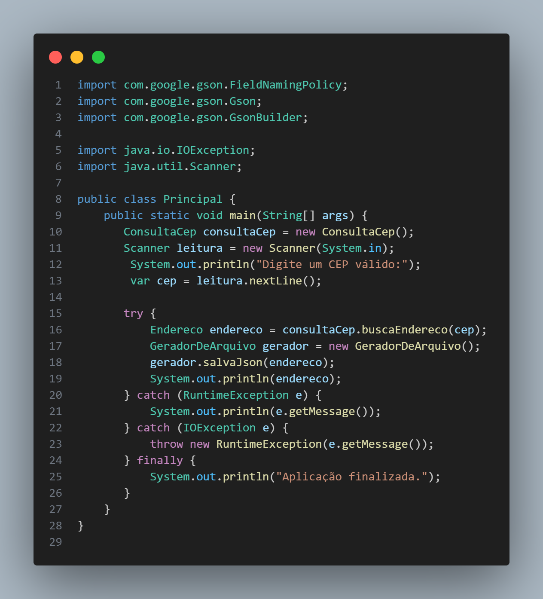

# 🌐 Desafio API

Este projeto foi desenvolvido como parte de um desafio de backend com **Java**, simulando o consumo de uma API para buscar e exibir dados dinâmicos. O desafio tem como objetivo reforçar os conhecimentos em requisições HTTP, manipulação de dados e organização de código Java.

## 🚀 Funcionalidades

- Realiza chamadas HTTP para uma API externa
- Processa e exibe os dados obtidos
- Organiza o código com boas práticas de orientação a objetos

## 📷 Imagem do Código Principal

## 🛠 Tecnologias Utilizadas

## 🧱 Estrutura do Projeto

O projeto está estruturado com:

- `ConsultaCep`: responsável por fazer a requisição e tratar a resposta
- `Main`: executa o programa e apresenta os dados ao usuário

## 💡 Aprendizados

Este desafio me permitiu colocar em prática:
- Consumo de APIs REST com Java
- Tratamento de exceções e erros de conexão
- Organização modular do código

## 🔗 Links Úteis

- [Java HTTP Client](https://docs.oracle.com/en/java/javase/11/docs/api/java.net.http/java/net/http/HttpClient.html)
- [VS Code](https://code.visualstudio.com/)
- [Git](https://git-scm.com/)
- [Repositório no GitHub](https://github.com/kalebemax/desafio-api)

